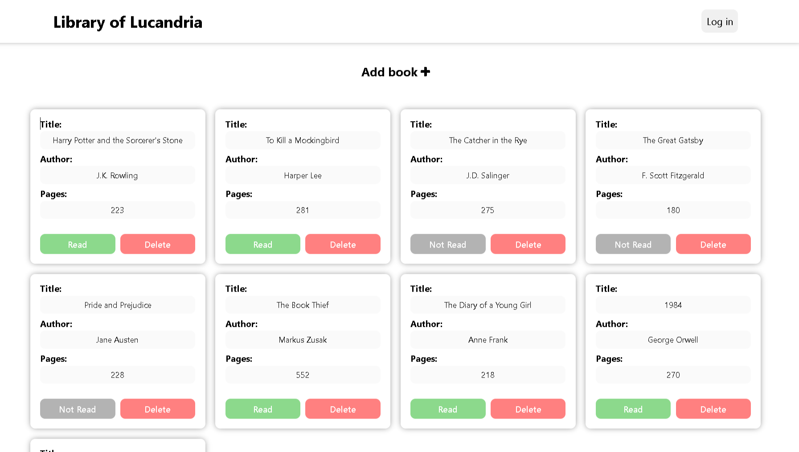

# Welcome to the Library of Lucandria 📚🐈!
Discover the ultimate solution for organizing and managing your personal library effortlessly. The Library of Lucandria is a user-friendly online platform designed for book enthusiasts, avid readers, and bibliophiles alike. Say goodbye to cluttered bookshelves and hello to streamlined book management!

The purpose of this project and the motivation behind its development is to enhance my skills in working with the object-oriented paradigm.
## Screenshot


## Getting Started

### Installation

1. Clone the repository to your local machine:

   ```bash
   git clone https://github.com/sebastianmsz/lucandrias-library.git
   ```

2. Open the project folder in your preferred code editor.

3. Launch the `index.html` file in a web browser to view the page.

### Live Demo
Experience the project live by visiting the [Lucandria's Library](https://sebastianmsz.github.io/lucandrias-library).

## Technologies Used

- HTML5
- CSS3
- JavaScript
- Git

## Contributions
If you're have ideas to enhance this project, contributions are highly encouraged. Open an issue or submit a pull request to share your insights.

## Contact
If you have questions, suggestions, or just want to discuss web development, feel free to reach out via email at sevas.molina2004@gmail.com.

Happy reading and happy coding! 📚
